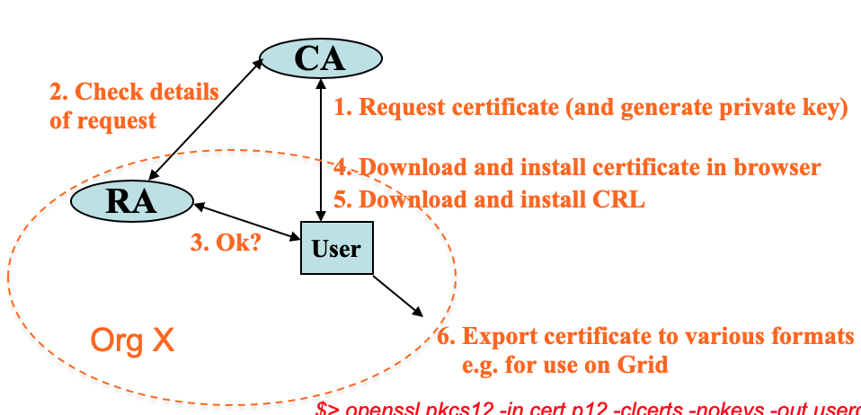
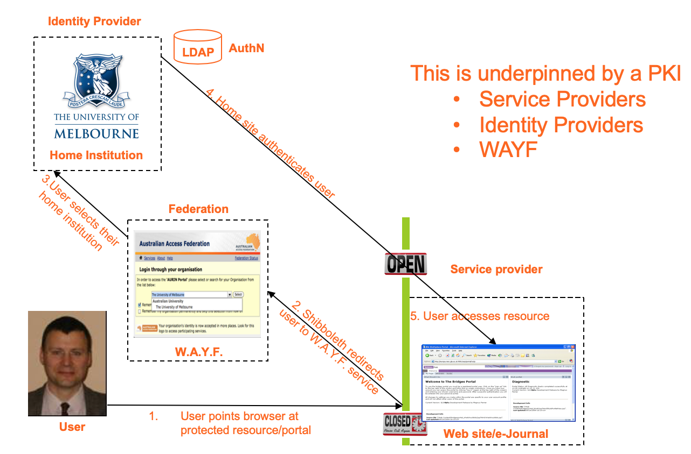
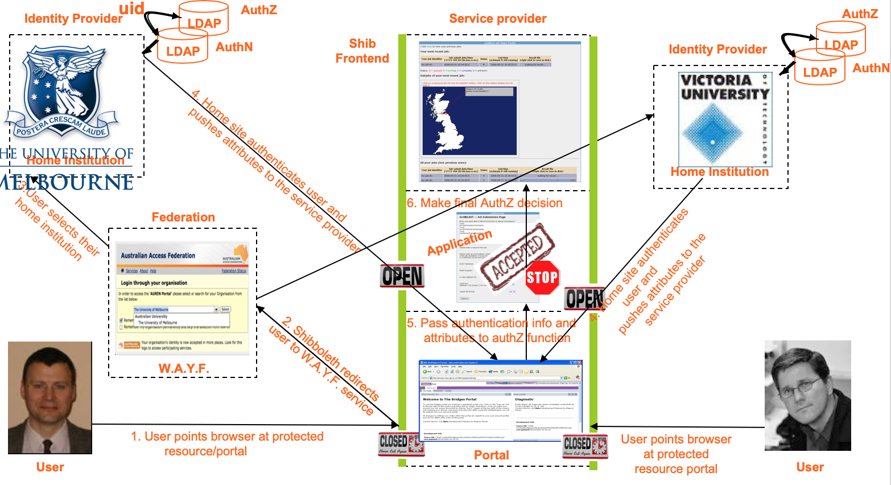

# Lecture 12.1 Security and Clouds

#### Why is security so important？
* If system (Grids/Clouds/outsourced infrastructure) not secure
    * 如果有安全问题，大团体就不会使用，要重复实验很expensive，有法律道德问题，丢失信任
    1. Large communities will not engage
        * or rather they will only use their own internal resources
    2. Expensive (impossible?) to repeat some experiments
        * Huge machines running large simulations for several years
    3. Legal and ethical issues possible to be violated with all sort of consequences
    4. Trust is easily lost and hard to re-establish
* Note: security technology ≠ secure system
    * 无法保证secure system

#### Technical Challenges of Security (7)
* Generally speaking
    1. Authentication 身份验证
    2. Authorisation
    3. Audit/accounting
* Domain specific
    1. Confidentiality
    2. Privacy
* Inter-organisational and Technological challenge
    1. Fabric management
    2. Trust

#### Authentication
* **Establishment and propagation** of a user's identity in the system
    * Centralised v.s. Decentralised systems
    * Public Key Infrastructure (PKI) (用public key的整套系统)
        * underpins (加固/加强) MANY systems
        * based on public key cryptography
* Public Key Cryptography 
    * aka. Asymmetric Cryptography (Public & Private keys)
    * Two distinct keys
        1. Private Key
        2. Public Key
    * Two keys complementary
        * cannot find out value of a private key from public key
        * with private key, can digitally sign messages, documents, ..., and validate them with associated public keys
    * Simplifies key management
        * don't need to have many keys for long time
* Public key Certificate
    * 看这个public key属于谁的，由认证机构发放
    * Mechanism connecting public key to user with corresponding private key
    * Issued by **trusted "Certification Authority"**

#### Certification Authority (CA)
* **Central component** of Public Key Infrastructure (PKI)
* CA has numerous responsibilities:
    1. Policy and procedure
    2. Issuing certificates
        * Often need to delegate to local **Registration Authority**
    3. Revoking certificates
        * Certificate Revocation (废弃) List (CRL) for expired / compromised (=hacked) certificates
    4. Storing, archiving (存档)
        * keep track of existing certificates, various other info, ...
* Typical Simple CA (centralised)
    * User请求certificate，CA叫RA去查身份，没问题的话CA发certificate，下载CRL，export这个certificate
    * RA: Registration Authority

#### PKI and *Cloud*
* **IaaS key pair**
* Cloud **inter-operability** begins in security
    * No single, ubiquitous CA (there are many)
* Need to **prove your identity** for access to: NeCTAR VMs, Spartan, ...

#### Decentralised Authentication (Proof of Identity) thru Shibboleth
* User要登陆的时候，Shibboleth把user转向WAYF，user选机构，机构验证user的身份，user获取资源
1. User points browser at protected resource/portal
2. Shibboleth redirects user to W.A.Y.F. service
3. User select their home institution
4. Home site authenticates user
5. User access Resource
* Support *Single Sign-On*
    * 单次登陆可以access多个相关系统
* Underpinned by PKI
    * Service Providers
    * Identity Providers
    * WAYF (Where Are You From)
* **Relation with Cloud for IaaS v.s. Usage of a Cloud**
    * What we really want: finner-grained (更细致的) security
    * Cloud don't tackle this now
    * Typically domain/user specific

#### Authorisation (授权/批准，查权利)
* Controlling access to resources based on policy
    * Can this user invoke this service, make use of this data?
    * Complementary to authentication
    * Many different approaches for authentication:
        1. Group Based Access Control
            * e.g. your project VMs
        2. Role Based Access Control (RBAC)
        3. Identity Based Access Control (IBAC)
        4. Attribute Based Access Control (ABAC)
        5. ...
* Typically applies to **services/data deployed on Cloud**
    * i.e. when they are running
    * 比如谁可以安装这个补丁
* Defining what they can do and define & enforce rules
    * Each site will have different rules/regulatins
* Often realised through **Virtual Organisation (VO)**
    * Collection of distributed resources whared by collection of **users from one more more organisations** typically work on common goal
* Many Technologies:
    * XACML, PERMIS, CAS, ...
* RBAC (Role-based Access Control) is **typical model**
    * Basic idea: 
        * **roles** applicable to specific collaboration
            * roles are often hierarchical
        * **actions** allowed / not allowed for VO members
        * **resources** comprising VO infrastructure (computers, data, etc.) 
    * A policy then consists of **set of these rules**
        * {Role x Action x Target}
        * Policy itself can be represented in many ways
            * XML documents, SAML, XACML, ...
        * Standards on when/where these used (PEP) and enforced (PDP)
    * Policy engines consume this information to make access decisions
* Shibboleth Augmented Authorisation

* 和之前的区别在于，Home institution不止authenticate了user, 还发送了attributes给service provider，service provider把authentication info和attribute都发给authZ function，然后决定用户有没有全县

#### Other cloud challenges
1. Single sign-on
    * Grid model (and Shib model) needed
    * Currently not solved for Cloud-based IaaS
    * Onus (责任) is on non-Cloud developerss to define / support this
2. Auditing
    * **logging, intrusion (干涉) detection，auditing (审核) of security** in external computer facilities
        * well established in theory, and practice and for local system
            * less mature in Cloud environments
        * Tools to support generation of diagnostic trails
3. Deletion (and encryption) 删不掉，不好删
    * Data deletion with no direct hard disk (不知道设备在哪)
        * Many tools and utilises don't work
    * Scale of data 不好删大数据量的
4. Liability 责任
5. Licensing 你要接受条款
    * Many licensing models
    * Challenges with the Cloud delivery model
6. Workflows
    * Many workflow tools for combining SoA services / data flows
    * Many workflow models
    * Serious challanges of 
        1. defining
        2. enforcing
        3. sharing
        4. enacting (制定)
    * security-oriented workflow
7. Ever Changing Technical / Legal Landscape 千变万化