# Lecture 3: Distributed & Parallel Computing Systems

#### Compute Scaling
* Vertical Scaling (速度)
    * Faster Processors
    * Limits of fundamental physics/matter
* Horizontal Scaling (量)
    * More Processors
        * Easier to get mroe
        * Harder to design, develop, test, debug, deploy, manage, understand, ...
        * For many / most folks: High-Throughput Computing (HTC) much more important than High-Performance Computing (HPC)
            * HPC 高性能计算机群(短期) -> characterized as needing large amounts of computing power for short periods of time
            * HTC 高通量计算机(长期) -> require large amounts of computing, but for much longer times (months and years, rather than hours and days)

#### (Types of) Adding More
1. Single machine multiple cores
2. Losely coupled cluster of machines (单纯共享资源)
    * Pooling / sharing of resources
3. Tighly coupled cluster of machines (机房那种，比loose更快)
    * Typical HPC / HTC set-up
    * Many server in same rack / server room (often with fast message passing interconnects)
4. Widely distributed clusters of machines (意义不明)
5. Hybrid combinations of the above

#### Adding more: limitations (Amdahl's Law)
* 因为有程序有non-parallizable (sequential) 的部分, 用再多的processor，加速（倍数）都会有上限
* 比如95%的程序都能被parallelized，**理论上**最多可以加速20倍 (1/alpha = 1/0.05 = 20, 可parallel的部分的计算时间无限接近于0)
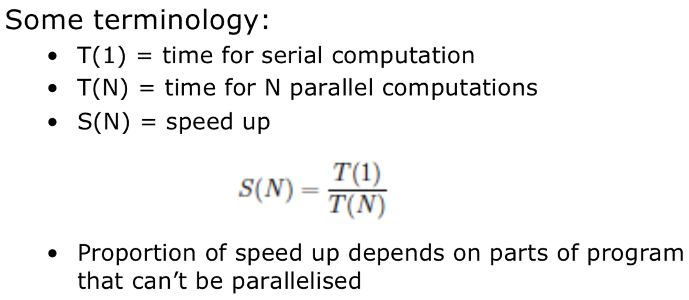
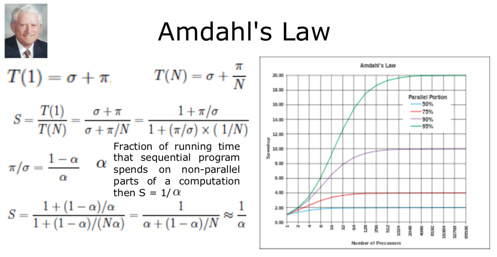

* Over simplification of Amdahl's Law
    * 例子
        * 比如一个program要跑单个loop，现在每个processor负责一个iteration
        * 那每个processor现在就需要处理loop overheads (检查guard, loop completion, etc.), 有多少个process, 这个overheads就有多少
        * 所以这些loop overheads又可以看作跑这段代码的 **serial overhead**
    * Also assumed a **fixed problem size**
        * Sometimes can't **predict length of time required** for jobs

#### Gaustafson-Barsis's Law
* Gives "Scaled Speed-up"
* Propose that programmers tends to set the size of the problems to use the available equipment to solve problem within a practical fixed times. Faster (more parallel) equipment available, larger problems can be solved in the same time.
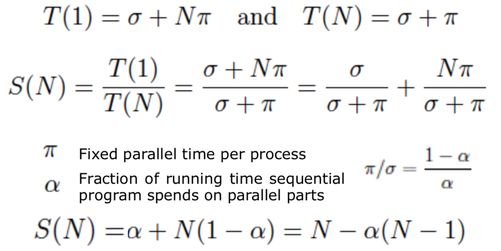

#### Difference between two laws
* Amdahl: 假设你要开60公里，你前一个小时只开了30公里(serial部分)，你后面30公里无论开多快(parallel部分)，你的平均速度都不可能到90公里/h
* Gaustafson: 我们不假设你到底要开多远，你前一个小时只开了30公里，只要你之后开的足够快(有足够多的时间和距离)，你总能达到平均90公里/h的速度

#### Computer Architecture
* A computer comprises:
    1. CPU for executing programs
    2. Memory that stores executing program & related data
    3. I/O systems (keyboards, networks, ...)
    4. Permanent storage for read/write data into/out of memory
    5. Balance of all of these (key importance, especially for HPC)

* Flynn's Taxonomy (分类系统，硬件)
     
    1. Single Instruction, Single Data Stream (SISD)
        * 对一份数据，执行一个instruction
        * PU -> Processing Unit
        * One operation at a time

        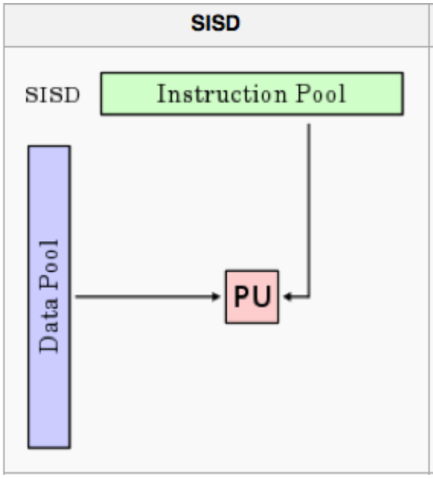 
    2. Single Instruction, Multiple Data Stream (SIMD)
        * 对多份数据，同时执行同样的insturction
        * Multiple processing elements that **perform the same operation** on multiple data points simultaneously

        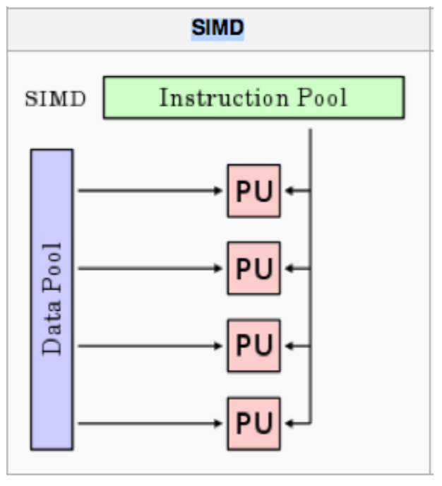 
    3. Multiple Instruction, Single Data Stream (MISD)
        * 对一份数据，同时执行多个instruction
        * Parallel computing architecture where many functional units (PU/CPU) perform **different operations on the same data**. 
        * Example: running multiple error checking processes on same data stream

        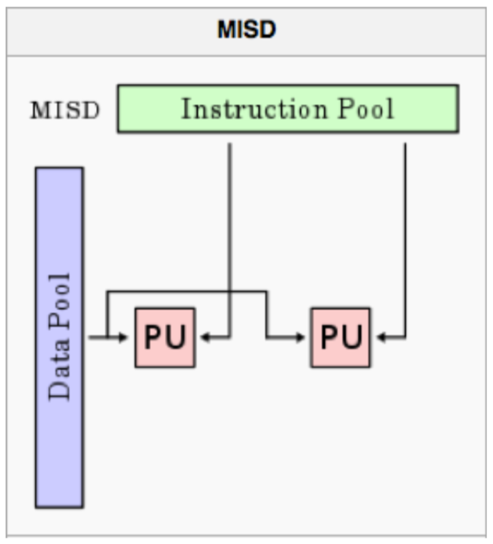 
    4. Multiple Instruction, Multiple Data Stream (MIMD)
        * 对多份数据，同时执行多个instruction
        * 现在最常用
        * At any time, different processors may be executing different instructions on different pieces of data
        * Machines can be **shared memory or distributed memory categories**

        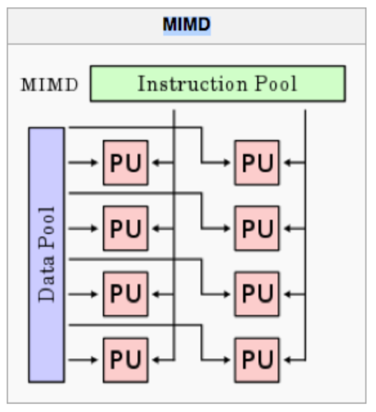 

#### Approaches for Parallelism
* Where and how
    * Explicit v.s. Implicit parallelism
        * Implicit
            * 不需要特别去写parallel
            * supported by parallel language or parallizing compilers
        * Explicit
            * 程序员自己写parallel
            * programmer is responsible for most of the parallelization effort: task decomposition, mapping tasks to processors, ...
            * Assume user is the best judge of how parallelism can be exploited for a particular application
    * Hardware
        * Cache: much faster than reading/writing to main memory
        1. Hardware Threading CPU
            * 多个CU，共享基本运算unit
            * Multiple control units, share arithmetic (基本运算) unit (Integer, Floating point, vector)

            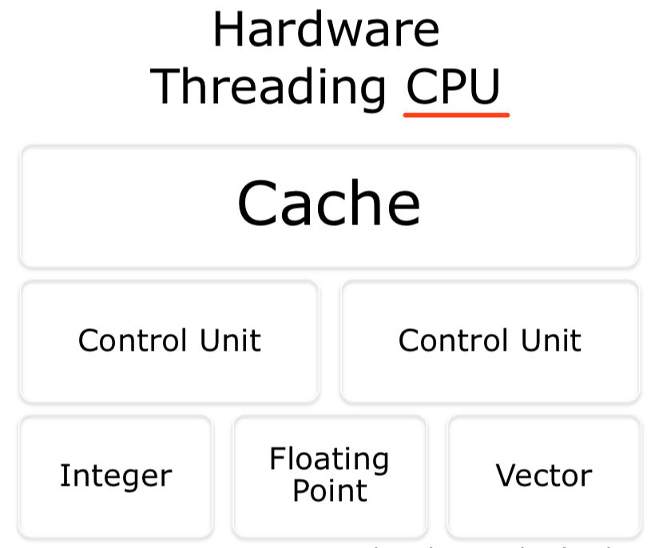 

        2. Multi-Core
            * 多个CU，独立基本运算unit
            * Can process data and perform computational tasks in parallel
            * Share same cache
            
            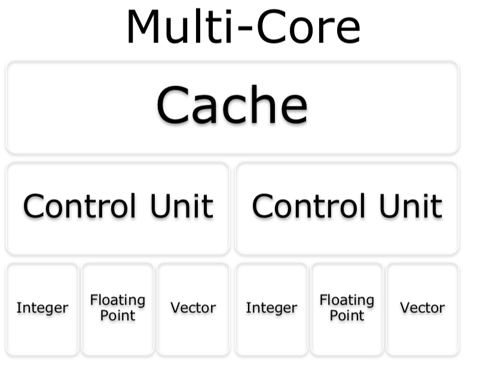 

        3. Symmetric Multiprocessing (SMP)
            * 多个CU，独立cache和基本运算unit，但共享main memory (跑不同program)
            * Two or more identical processors connected to a single, shared main memory
            * Each processor executes different programs and works on different data but with capability of sharing common resources
            * Need inter-process communication
             

        4. Non-Uniform Memory Access (NUMA)
            * 每个CPU有独立的memory, CPU之间可以交流
            * Speed up by allowing processor to access **its own local memory**, faster than non-local memory.
            * Key: allocate memory/processors in NUMA friendly ways (e.g. avoid inter-processor communication)
             

    * Operating System
        1. Modern multi-core operating systems support different "forms" of parallisation
            * parallel v.s. interleaved semantics (意义不明)
        1. Compute parallelism
            * Processes
            * Threads
        2. Data parallelism
            * Cashing
            * OS implies on "a" computer (意义不明)
    * Software / Applications
        * 现在很多语言支持 parallel
        * Most language now support a range of parallelisation / concurrency features
            * Threads, thread pools, locks, ...
        * Many language developed specifically for parallel/concurrent systems
        * Key issues:
            * Deadlock
            * Livelock (processes constantly change with regard to one another, but none are progressing)
    * Some or all of these

#### Message Passing Interface (MPI)
* Widely adopted approach for message passing in parallel systems
* Mappings to major language: Fortran, C, C++, Python, Java
* **Key MPI functions**:
    1. MPI_init: init MPI computation
    2. MPI_Finalize: terminate computation
    3. MPI_COMM_SIZE: number of processors
    4. MPI_COMM_RANK: my process id
    5. MPI_SEND: send a message
    6. MPI_RECV: receive a message
* Support **point-to-point** and **broadcast** communications

(HT)Condor -> a specialiszed workload management system for compute-intensive jobs (跟spartan差不多)

#### Data Parallelism Approaches
* (在上面OS parallel出现过)
* Challenges of big data
* Distributed data
    * CAP theorem (Consistency, Availability, Partition Tolerance)
    * ACID <-> BASE (意义不明)
* Distributed File Systems
    * e.g. Hadoop, Lustre, ...

#### Challenges with Distribution (Distributed Systems)
* Distributed System -> one in which the failure of a computer you didn't even know existed can render your own computer unusable
* General assumptions that typically don't hold in the real world

#### Some Erroneous Assumptions of Distributed Systems
1. Network is reliable
    * 数据会传送到，顺序正确，无损坏 (not always true!)
    * Send some data over the network
        * Will arrive, in correct order, uncorrupted (无损坏)
        * Consistency
    * The Lower layers in the networking stack protect me from these issues
2. Latency is zero
    * Data arrive "now" (immediately)
3. Bandwith is infinite
    * Can send any amount of data i wish between nodes
4. Network is secure
    * Don't have to worry about:
        1. People sending data to my services
        2. People actively attacking me
        3. People reading the data sent over the network
        4. ...
5. Topology doesn't change
    * Node x is **always there**
    * (Assume) Fixed:
        1. Latency
        2. IP
        3. Route
        4. Services
    * Typically cannot guarantee the route taken, and hence latency
6. There is one administrator
    * One administrator of the distributed system
    * Firewall changes, server reconfigurations, services, access control (意义不明)
7. Transport cost is zero
    * Can send as much data as I like for free
    * Truth: NEVER FREE
8. Network is homogenous
    * A wide range of network communication protocols
9. Time is ubiquitous (无处不在)
    * Time is same across all computers in the network
10. And issues of heterogeneity of compute, data, security, ...

#### Strategies for Development of Parallel/Distributed Systems
* Challenges: **Dependency analysis**
    * Hard for code that uses pointers, recursion, ...
    * Loops can have unknown number of iterations
    * Access to global resources, e.g. shared variables
* Design Stages of Parallel Programs:
    1. Partitioning
        * 把计算和数据都分成小任务
        * Decomposition of computational activities and data into smaller tasks
        * Numerous paradigms (样式):
            1. Master-Worker
            2. SPMD
            3. pipeline
            4. Divide and Conquer
            5. Speculation
    2. Communication
        * 交流，协作
        * Flow of information and coordination among tasks that are created in the partitioning stage
    3. Agglomeration (成团)
        * Structure好不好看performance和implementation cost, 有时候大的task可能communication更好
        * Since tasks and communication structure -> evaluated for **performance and implementation cost**
        * Tasks may be grouped into larger tasks to improve communication
        * Individual communications can be bundled
    4. Mappling / Scheduling
        * 把task分给process，要minimise completion time，还有最大化的使用resource
        * Assigning tasks to processes such that job completion time is minimized and resource utilization is maximized
* Models (Parititioning):
    1. Master-Slave Model
        * Master拆分问题，分给slave去计算，然后gather起来得到最终结果
        1. Master decomposes the problem into smaller tasks
        2. Distributes to workers
        3. Gather partial results to produce the final result
        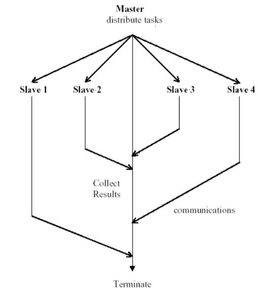 

    2. Single-Program Multi-Data (SPMD)
        * 数据拆封给多个process执行同样的code
        * 每个process本身会去取不同的数据
        * Each process executes the **same piece of code**, but on **different parts of the data**
        * Data is typically split among the available processes
        * Data splitting and analysis can be done in many ways
        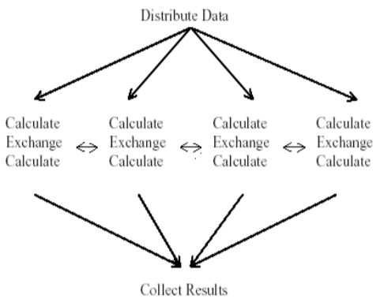 

    3. Data Pipelining
        * Suitable for applications involving **multiple stages of execution**, that typically operate on large number of data sets 
        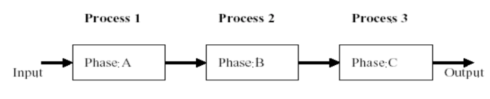 

    4. Divide-and-Conquer
        * A problem is divided into two or more sub problems
        * Each of these sub problems are **solved independently**, and their **results are combined**
        * 3 operations: **Split, Compute, Join**
        * Master-worker / task-farming is like divide and conquer with master doing both split and join operation
        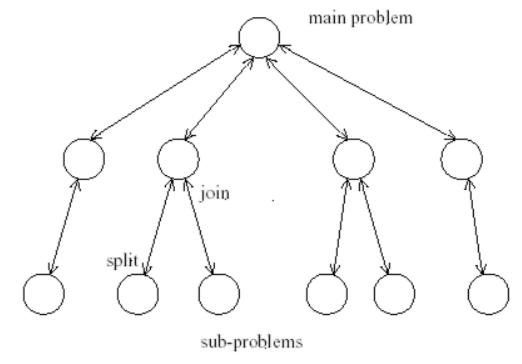 

    5. Speculative (推理的) Parallelism
        * 其他样式不合适的时候用这个
        * 适合解决复杂的dependencies，通过**预测**variable的值来消除dependency，从而enable parallelism (如果prediction对了就提高performance)
        * Used when it is quite difficult to achieve parallelism through the previous paradigms
            * Problems with **complex dependencies** - use "look ahead" execution
            * Producer P & Consumer C
                * C depends on P for the value of some variable V
                * If the value of V is **predictable**, we can execute C **speculatively** using a predicted value in parallel with P
                * If prediction correct -> **gain performance**! (C doesn't wait for P anymore)
                * If prediction incorrect -> take corrective action, cancel C and restart C with the right value of V
        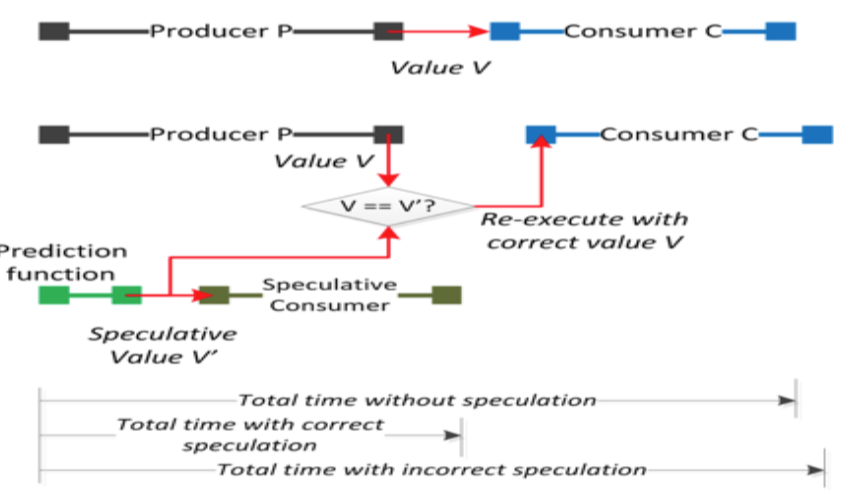 
        