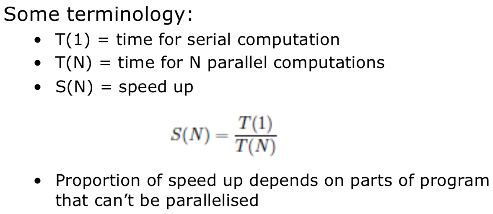
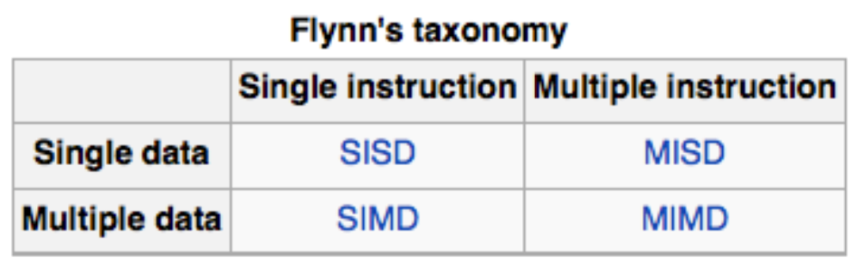
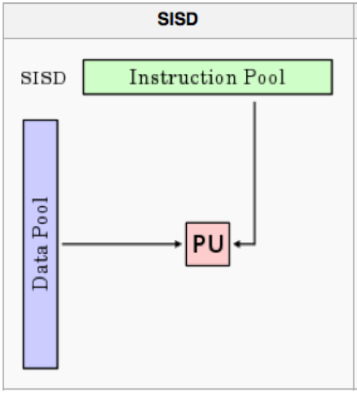
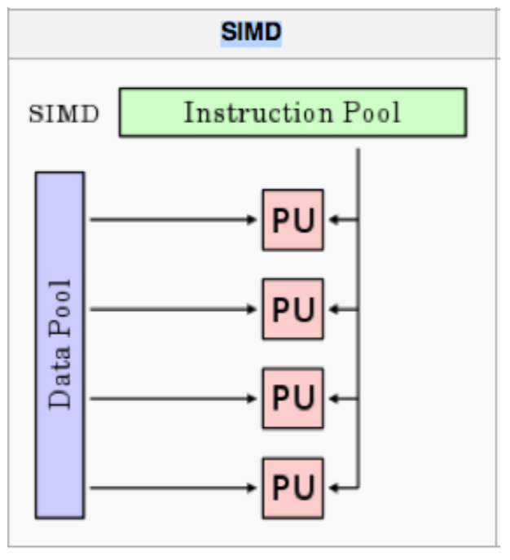
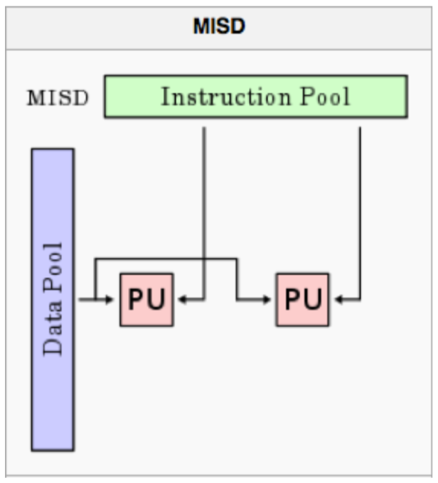
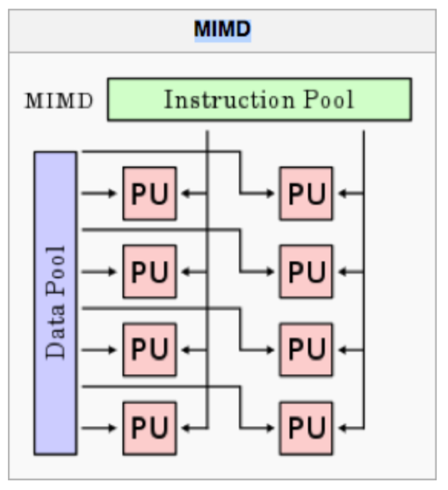
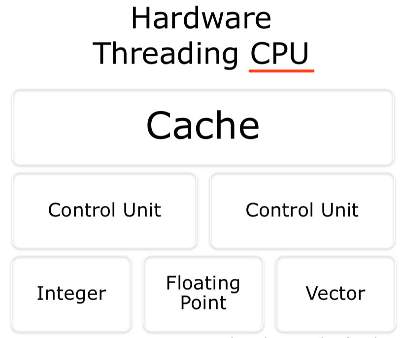
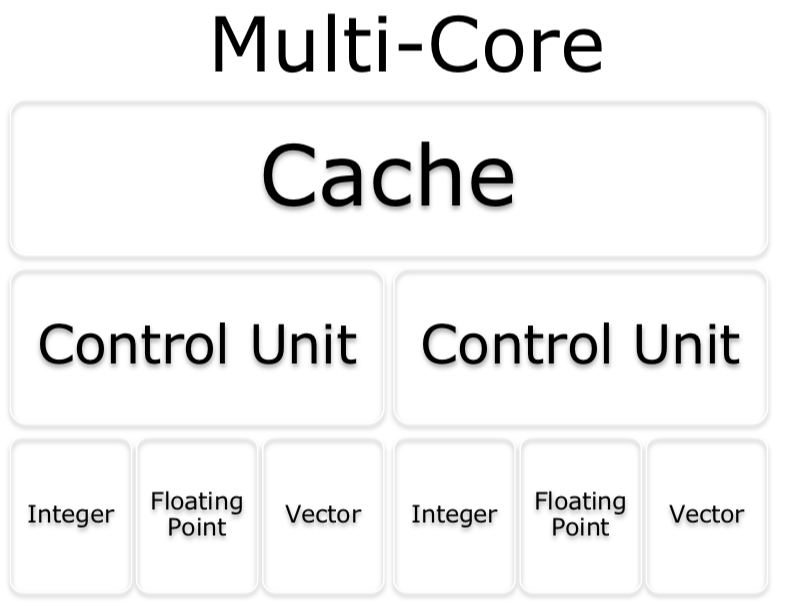

# Lecture 3: Distributed & Parallel Computing Systems

#### Compute Scaling
* Vertical Scaling (速度)
    * Faster Processors
    * Limits of fundamental physics/matter
* Horizontal Scaling (量)
    * More Processors
        * Easier to get mroe
        * Harder to design, develop, test, debug, deploy, manage, understand, ...
        * For many / most folks: High-Throughput Computing (HTC) much more important than High-Performance Computing (HPC)
            * HPC 高性能计算机群(短期) -> characterized as needing large amounts of computing power for short periods of time
            * HTC 高通量计算机(长期) -> require large amounts of computing, but for much longer times (months and years, rather than hours and days)

#### (Types of) Adding More
1. Single machine multiple cores
2. Losely coupled cluster of machines (单纯共享资源)
    * Pooling / sharing of resources
3. Tighly coupled cluster of machines (机房那种，比loose更快)
    * Typical HPC / HTC set-up
    * Many server in same rack / server room (often with fast message passing interconnects)
4. Widely distributed clusters of machines (意义不明)
5. Hybrid combinations of the above

#### Adding more: limitations (Amdahl's Law)
* 因为有程序有non-parallizable (sequential) 的部分, 用再多的processor，加速（倍数）都会有上限
* 比如95%的程序都能被parallelized，**理论上**最多可以加速20倍 (1/alpha = 1/0.05 = 20, 可parallel的部分的计算时间无限接近于0)

* Over simplification of Amdahl's Law
    * 例子
        * 比如一个program要跑单个loop，现在每个processor负责一个iteration
        * 那每个processor现在就需要处理loop overheads (检查guard, loop completion, etc.), 有多少个process, 这个overheads就有多少
        * 所以这些loop overheads又可以看作跑这段代码的 **serial overhead**
    * Also assumed a **fixed problem size**
        * Sometimes can't **predict length of time required** for jobs

#### Gaustafson-Barsis's Law
* Gives "Scaled Speed-up"
* Propose that programmers tends to set the size of the problems to use the available equipment to solve problem within a practical fixed times. Faster (more parallel) equipment available, larger problems can be solved in the same time.

#### Difference between two laws
* Amdahl: 假设你要开60公里，你前一个小时只开了30公里(serial部分)，你后面30公里无论开多快(parallel部分)，你的平均速度都不可能到90公里/h
* Gaustafson: 我们不假设你到底要开多远，你前一个小时只开了30公里，只要你之后开的足够快(有足够多的时间和距离)，你总能达到平均90公里/h的速度

#### Computer Architecture
* A computer comprises:
    1. CPU for executing programs
    2. Memory that stores executing program & related data
    3. I/O systems (keyboards, networks, ...)
    4. Permanent storage for read/write data into/out of memory
    5. Balance of all of these (key importance, especially for HPC)

* Flynn's Taxonomy (分类系统)
     
    1. Single Instruction, Single Data Stream (SISD)
        * 对一份数据，执行一个instruction
        * PU -> Processing Unit
        * One operation at a time

         
    2. Single Instruction, Multiple Data Stream (SIMD)
        * 对多份数据，同时执行同样的insturction
        * Multiple processing elements that **perform the same operation** on multiple data points simultaneously

         
    3. Multiple Instruction, Single Data Stream (MISD)
        * 对一份数据，同时执行多个instruction
        * Parallel computing architecture where many functional units (PU/CPU) perform **different operations on the same data**. 
        * Example: running multiple error checking processes on same data stream

         
    4. Multiple Instruction, Multiple Data Stream (MIMD)
        * 对多份数据，同时执行多个instruction
        * 现在最常用
        * At any time, different processors may be executing different instructions on different pieces of data
        * Machines can be **shared memory or distributed memory categories**

         

#### Approaches for Parallelism
* Where and how
    * Explicit v.s. Implicit parallelism
        * Implicit
            * 不需要特别去写parallel
            * supported by parallel language or parallizing compilers
        * Explicit
            * 程序员自己写parallel
            * programmer is responsible for most of the parallelization effort: task decomposition, mapping tasks to processors, ...
            * Assume user is the best judge of how parallelism can be exploited for a particular application
    * Hardware
        * Cache: much faster than reading/writing to main memory
        1. Hardware Threading CPU
            * 多个CU，共享基本运算unit
            * Multiple control units, share arithmetic (基本运算) unit (Integer, Floating point, vector)
         
        2. Multi-Core
            * 多个CU，独立基本运算unit
            * Can process data and perform computational tasks in parallel
            * Share same cache
         
        3. Symmetric Multiprocessing (SMP)
            * 多个CU，独立cache和基本运算unit，但共享main memory (跑不同program)
            * Two or more identical processors connected to a single, shared main memory
            * Each processor executes different programs and works on different data but with capability of sharing common resources
            * Need inter-process communication
         
        4. Non-Uniform Memory Access (NUMA)
            * 每个CPU有独立的memory, CPU之间可以communicate
            * Speed up by allowing processor to access **its own local memory**, faster than non-local memory.
            * Key: allocate memory/processors in NUMA friendly ways (e.g. avoid inter-processor communication)
         
    * Operating System
    * Software / Applications
    * Some or all of these

#### Some Erroneous Assumptions of Distributed Systems
1. Network is reliable
2. Latency is zero
3. Bandwith is infinite
4. Network is secure
5. Topology doesn't change
6. There is one administrator
7. Transport cost is zero
8. Network is homogenous
9. Time is ubiquitous