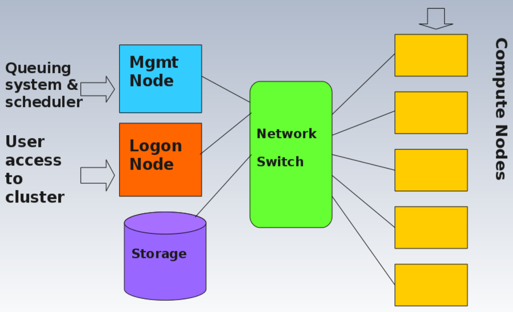
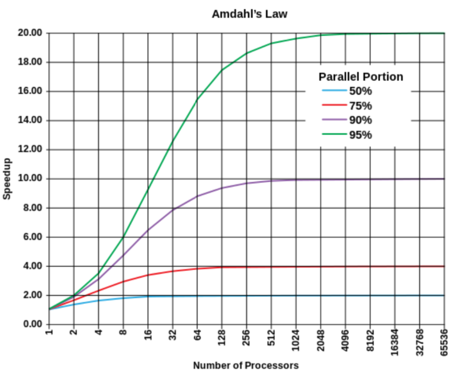

# Lecture 4: HPC and MPI

#### Supercomputers
* 任何有**高处理力**的计算机系统
* Any single computer system that has exceptional processing power for its time.

#### High Performance Computing (HPC)
* 任何有**可以达到高性能的架构**的计算机系统
* Any computer system whose architecture allows for above average performance
* Clustered computing: two or more computers serve a single resource
    * Improve performance and provide redundancy
    * Typically a collection of smaller computers strapped together with a high-speed local network 
* Clustered HPC
    * More **efficient, economical, and scalable** method -> dominates supercomputing

#### Parallel and Research Programming
* Parallel Computing
    * 数据和task分给多个processors处理
    * Submission of jobs or processors over multiple processors and by **splitting up data or tasks** between them
* Research Computing
    * 研究人员用的，问题：数据产生的越来越：快，多，多样
    * Software applications used by a research community to aid research
    * Major problem: volume/velocity(产生速度)/variety (3V) of datasets increases, the researchers will need to be able to process this data

#### HPC Cluster Design

#### Limitations of Parallel Computation
* Speedup (p) = Time (Serial) / Time (Parallel)
* Amdahl's law establishes the maximum improvement to a system (assumed fixed problem size)

#### Unimelb's HPC: Spartan
* A model of a HPC-Cloud Hybrid
* Featured in OpenStack and HPC Workload Management
* Environment Module
    * 用来改用户的environment
    * Dynamic **modification** of the user's **environment** via module files (e.g. paths)
    * Contains the necessary configuration info for user's session to operate according to the module loaded
    * Advantage: 
        * 给用户共享，并且可以安装同个应用的**不同版本**
        1. Shared with many users on a system
        2. Easily allowing multiple installations of the **same applications with different versions** and compilation options
* Module commands
    1. `module help` provides a list of switches, subcommands, and subcommand arguments
    2. `module avail` lists **all modules** which are available to be loaded
    3. `module whatis <modulefile>` description of the module
    4. `module display <modulefile>` to see exactly what a given modulefile will do to your environment (e.g. what will be added to PATH)
    5. `module load <modulefile>` add one or more module files to user's current environment
    6. `module unload <modulefile>` remove module from user's current environment
    7. `module purge` remove **all** modules from user's current environment
    8. In Spartan: `module spider` search for all possible modules (not just those in the existing module path)

#### Batch Systems and Wordload Managers
* Portable Batch System (PBS)
    * a utility software that **perform job scheduling** by assigning unattended background tasks expressed as **batch jobs** among the available resources
* Slurm Workload Manager
    * a popular job scheduler
    * also use **batch script** (very similar in intent and style to PBS script)
* Job scripts can be translated between PBS & Slurm

#### X-Windows Forwarding
* Cluster上做计算，用local来visualise结果
* Do computation on the cluster, visualisation on a local system
* Login with -Y option for security, then login with -X to the login node
* Compute node will then pass through the graphics via login node to the desktop system
* Need an X-window client on your desktop for the visualisation

#### Parallel Programmming
1. Shared Memory
2. Distributed Memory