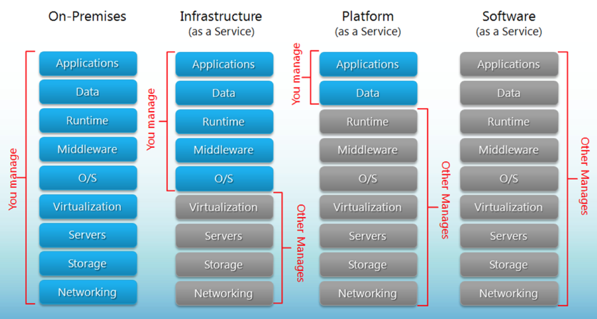
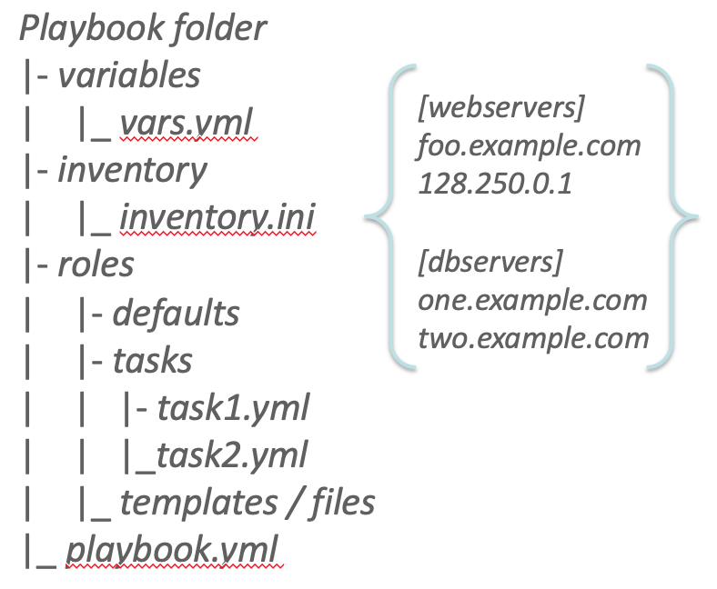
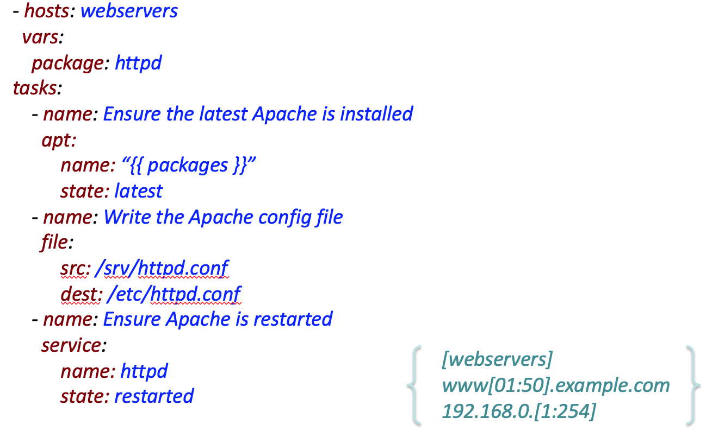
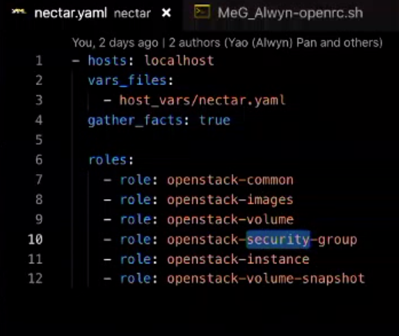

# Lecture 4: Cloud Computing & NeCTAR/Unimelb Cloud & Scripting

#### Cloud Computing
* Defininition: 
    > a model for enabling ubiquitous, convenient, on-demand network access to a shared pool of configurable computing resources (e.g., networks, servers, storage, applications, and services) that can be rapidly provisioned and released with minimal management effort or service provider interaction
* Most common cloud models
    1. Deployment models
        1. Private
        2. Community
        3. Public
        4. Hybrid (of above)
    2. Delivery Models
        1. **Software** as a Service (SaaS)
        2. **Platform** as a Service (PaaS)
        3. **Infrastructure** as a Service (IaaS)
    3. Essential Characteristics (5 characteristics in week1)
        1. On-demand self-service
        2. Broad network access
        3. Resource pooling
        4. Rapid elasticity
        5. Measured service

#### Deployment models (部署Cloud的模型)
1. Public Cloud
    * Pros
        * Utility (公用) computing
        * Can focus on core business (不需要关心intrastructure building和维护)
        * Cost-effective
        * "Right-sizing" (应该是指elasticity)
        * Democratisation (民主化) of computing
    * Cons
        * Security
        * Loss of control
        * Possible lock-in (占据)
        * Dependency of Cloud provider continused existence
2. Private Cloud
    * Pros
        * Control
        * Consolidation (巩固/合并) of resources
        * Easier to secure
        * More trust
    * Cons
        * Relevance to core business?
        * Staff / Management overheads
        * Hardware obsolescence (废弃/过时)
        * Over/under utilisation challenges
3. Hybrid Clouds (Public + Private)
    * Pros
        * 平时在private里跑，需要的时候用public
        * Cloud-bursting
            * Use private cloud, but **burst** into public cloud when needed
    * Cons
        * 怎么移动数据，怎么实时决定移动什么数据
        * How do you move data / resources when needed
        * How to decide (in real time) what data can go to public cloud
        * Is the public cloud compliant (遵从) with PCI-DSS (Payment Card Industry - Data Security Standard)
4. Community Cloud (没讲)

#### Delivery Models (提供service的模型)
* 不同模型的separation of responsbilities不同 
    * 每一块是你还是service provider来manage

* Software as a Service (SaaS)
    * 整个software打包好了来使用
    * public Saas examples: Gmail, Sharepoint, Microsoft 365, ...
* Infrastructure as a Service (IaaS)
    * 这门课的要点
    * 提供了Server和Storage之类的，自己选择操作系统，管理数据和开发应用
    * Many providers: AWS, Orable Public Cloud, Rackspace Cloud, Nectar/Openstack Research Cloud....
* Platform as a Service (PaaS)
    * 只能管理数据和自己开发应用
    * public Paas Examples: Google App Engine, Microsoft Azure, Amazon Elastic MapReduce, ...

#### NeCTAR (with OpenStack)
* Instances 主机/虚拟机
* Volumes 硬盘
    * Can be attached / detached
    * Must be in the same availability zone as the instance
* Images 映像
    * Instance的image通常有OS（有的有docker）
* Flavor
    * 多少核多少RAM
    * Defines the **compute, memory and storage** capacity
* Snapshot
    * Snapshot of instance
        * 复制一份root disk的state (File system + OS)
        * Create copy of the **disk state** (root disk) of your instance in an **image**
        * Not storing data on ephemeral disk
    * Snapshot of volume
        * 类似backup，但snapshot不是设计来backup用的
        * Preserving the state of your volume in an **image**
        * Same size as your volume
* Ephemeral (短暂) Disk
    * 临时用的disk，VM没了就没了
    * Only persistent until the termination / rebuild of the VM, similar to the root disk
    * Not persistence storage
* Launching a new VM
    1. Choose Flavor
    2. Ephemeral Disk
    3. Create Key pair
    4. Copy pub key
    5. Select key pair
    6. Select security group
    7. Availability zone
* Security Group
    * 基本就是定义能不能SSH，HTTP什么的，还有对应的port
    * A set of security rules which define network access control lists (ACLs)
    * Rules are expressed as tuple of (direction, protocol, port, remote host IP)
    * Default: allow SSH

#### Automation with Ansible
* Deploying complex cloud systems require a lot of moving parts -> **NEED AUTOMATION**
    * Easy to forget what software you installed, and what steps you took to configure the system (比如安装软件和设置环境/变量)
    * Manual process is error-prone, can be non-repeatable
    * Snapshots are monolithic (巨大) - provide no record of what has changed
* Automation
    * Provide record of what you did
    * Condifies knowledge about the system
    * Make process **repeatable**
    * Make it programmable - "Infrastructure as Code"
    * **Make servers reach a desirable _state_**
* Cloud-focused
    * Used to **interact with cloud services**
        * 比如调用OpenStack来建立instance
        * Apache JClouds, Boto, OpenStackClient, ...
* Shell scripts
    * Bash
    * Perl
    * 或者ansible用的YAML之类的
* Configuration Management (CM) tools
    * CM - the process of **systematically handling changes** to a system in a way that it **maintains integrity** over time.

#### Ansible (a CM tool)
* Automation tool for **configuring and managing computers**
    * Finer grained setup and configuration of software packages
* Combines multi-node software deployment
* Ad-hoc **task** execution and configuration management
    * Configuring thousands of machine manually
* Easy to learn
    * Playbooks in YAML
    * Sequential Execution
* Minimal Requirements
    * 不需要专门管理这些的server
    * No need for centralized management servers/daemons 
    * Single command to install (pip install ansible)
    * Uses SSH to connect to target machine
* Idempotent (repeatable)
    * Executing N times no different to executing once
    * Prevent side-effects from re-running scripts
* Extensible
    * Can write your own modules
* More Features
    * Support push or pull
    * Rolling updates
    * Inventory management
    * Ansible Vault for encrypted data
    * Ad-hoc commands
        * Execute a one-off command against your inventory
    * Ansible Galaxy
    * Ansible Tower (Enterprise control for Ansible)
        * Dashboard, System Tracker, ...
* Ansible Playbooks are expressed in YAML
    * YAML: YAML Ain't Markup Language
    * YAML is a human friendly data serialization standard for all programming lnaguages
* Ansible use Jinja2 template for **dynamic expression**
    * Jinja2 is a modern and designer-friendly templating language for Python, modelled after Django's templates
* Structure
    * Ansible scripts are called **playbooks**, written as simple YAML files
    * Structured in simple folder hierarchy
        * Inventory: hostS and host groups
    
    * Executed Sequentially from a YAML file
    

#### Create an instance with Ansible
* Download `openrc.sh` from Dashboard
* Prerequisite: (需要的信息)
    1. Instance flavor: uom.general.2c8g
    2. Availability Zone: melbourne-qh2-uom
    3. Image Id: 8d49e526-802c-4b90-a318-f64a87f07039
* Then, use playbook to interact with Melbourne Research Cloud
    1. Define some variables in vars.yml
        * e.g. prerequisites above: flavor, zone, ...
    2. Pip install **openstacksdk** to interact with OpenStack API
    3. Retrieve all available OpenStack images
        * use module from OpenStack API: "os_image_fact"
    4. Get image names and Ids
        * loop through variable "{{ openstack_image }}"
        * put all names and ids into a list called "image_facts"
    5. Create an instance
        * use module from OpenStack API: "os_server"
    6. Get the ip address of the instance
    7. Create Security group
        * use module from OpenStack API: "os_security_group"
    8. ...
    9. In the final playbook
        * `gather_facts`  to gather facts from OS of the host
        * Run the roles sequentially
            * Has dependencies between roles (need correct order)

        
    10. Run the playbook
        1. `./openrc.sh`
        2. `ansible-playbook --ask-become-pass nectar.yaml`

#### 补充一些playbook的说明
1. YAML files
    * Start with `---`
    * End with `...`
2. YAML Syntax
    * Lists
    ``` YAML
        fruits:
            - Apple
            - Orange
            - Strawberry
    ```
    * Dictionary:
    ``` YAML
        martin:
            name: Martin D'vloper
            job: Developer
            skill: Ellite
    ```
    * Boolean
    ``` YAML
        create_key: yes
        know_oops: TRUE
        likes_emacs: True
    ```
    * Double Quotes: can use escape, preserve colons
    ``` YAML
        foo: "a \t TAB and a \n : NEWLINE"
    ```
    * Variables
    ``` YAML
        "{{ web_service_name }}"
    ```
    * Become: privilege escalation (priviledged user)
    ``` YAML
        - hosts: webservers
          remote_user: yourname
          become: yes
    ```
    * vars: define variables for this play
        ``` YAML
        - hosts: webservers
          vars:
            http_port: 80
            max_clients: 200
            remote_user: root
          tasks:
            - name: ensure apache is at the latest version
              yum:
                name: httpd
                state: latest
        ```