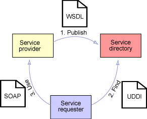
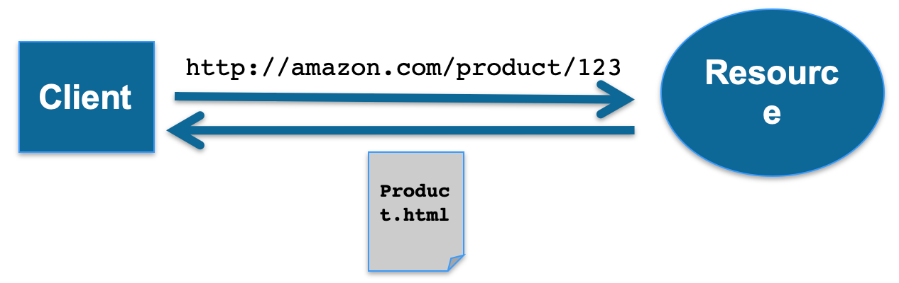
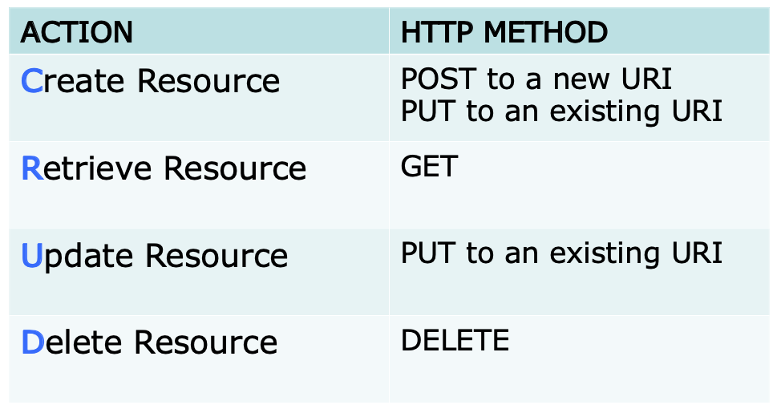

# Lecture 6: Web Services, REST Services, Twitter, Docker, and Containerisation

#### Architecture and Service-oriented Architecture
* System Architecture
    * Software component 怎么分布和交互的
    > The way different software components are **distributed** on computers, and the way which they **interact** with each other.
* Service-oriented Architecture (SoA)
    * When components are distributed (on different machine), cannot communicate directly
        * therefore components **interact** in more loosely-coupled ways
    * **Services** are often used for this
        * Service还是用来interact
    * Typically, combinations and commonality (公共性) of services can be used to form a **SoA**
* SoA can serve many goals 可以达到各种目标
    1. 提供一组对外的服务 (客户，或合作伙伴)
        * A set of externally facing services that a business wants to provide to their customers or parterns / collaborators
    2. 一种基于服务供应商，中间人，和服务器请求者之间的协定的architecture pattern
        * An architecture pattern based on service providers, one or more brokers, and service requestors based on agreed service descriptions 
    3. 一个由各种标准，工具，和支持开发和帮助服务的技术，组成的编程模型
        * A programming model complete with standards, tools, and technologies that supports development and support of service
    4. 使用中间件来优化服务的装配，编制，监控，和管理
        * A middleware solution optimized for service assembly, orchestration, monotoring, and management
            * Can include tools and approaches that combine services together (e.g. as workflows)
* SoA Design principles (14)
    1. Standardized service contract
        * 遵守通讯协定
    2. Service loose coupling
        * Service之间的依赖小
    3. Service abstraction
        * 除了在通讯contract的描述以外，不展示服务的具体逻辑
    4. Service reuseability
        * 逻辑被拆分为多个服务，鼓励再使用
    5. Service autonomy
        * 服务可以控制他里面封装的逻辑
    6. Service statelessness
        * 服务推迟管理state，从而减少资源使用
    7. Service discoverability
        * 
    8. Service composability
        * 服务很适合用于组合
    9. Service granularity
        * 使用合适的业务功能(business functionality)的粒度
    10. Service normalisation
        * 服务被分解/合并到一个程度来减少redundancy, 提高性能，access，和聚集
    11. Service optimization
        * 高质量服务
    12. Service relevance
        * 功能，以一个被用户认为是有意义的服务的粒度，被呈现
    13. Service encapsulation
        * 很多service被合并起来，不被看到里面的内容
    14. Service location transparency
        * 让使用者在网络的任何位置都能使用

#### SoA for Web: Web Services
* Web services used to **implement SoA** has two main flavors:
    1. **SOAP-based** Web Services
        * 基于RPC，可用别的protocol，不用HTTP
        * built upon Remote Procedure Call (RPC) paradigm: language independent _function call_ that spans (跨越到) another system
        * a stack of protocols that cover every aspect of using a remote service
    2. **ReST-based** Web Services
        * 使用HTTP来操控/管理resources
        * centered around **resources** and the way they can be manupulated remotely
        * a style to use **HTTP** than a separate protocol
    * many other WS ...
* Both use HTTP, hence can run over the **web**
    * Although SOAP/WS often run over other protocols as well

#### SOAP-based WS
* Web Service Description Language (WSDL)
    * **XML-based** interface description language
    * Describe the _functionality_ offered by a web service
    * Provide a _machine-readable_ description of how the service can be called, what params expected, what results/data structures it returns
    * Language independent and location transparency
* Registry
    * 用来查找Web Services
    * Defines how to find a Web Service
    * Registers a Web Service so consumers can find it
    * Uniform Description, Discorvery and Integration (UDDI) is a protocol to access a _registry of services_
* Other standards for SOAP WS
    * WS-Security
    * WS-ReliableMessaging
    * WS-Notification
    * WS-Addressing

    

#### RESTful Web Service
* Representational State Transfer (ReST)
    > A network of web pages (a virtual **state-machine**), where the user progresses through an application by selecting links (state transitions), resulting in the next page (representing the next stage of the application), (web pages) being transferred to the user and rendered for their use.
* Example
    * 客户每次fetch一个新的resource(.html), transit到另一个state
    1. Client request resource through URL
    2. Server/proxy send representation of Resource
    3. This put the client in a certain state
    4. Representation contains URLs allowing navigation
    5. Client follow URL to fetch another resource
    6. This transit client into yet another state
    7. **Representational State Transfer!**

    

#### Resource Oriented Architecture (ROA)
> A way of turning a **problem** into a **RESTful web service**: an arrangement of URIs, HTTP, and XML that works like the rest of the Web
* Resource:
    * Anything that is important enough to be referenced as a thing in itself
    * You should make it into a resource if your user might:
        * want to create a hyperlink to it
        * retrieve or cache a representation of it
        * annotate it
        * perform operations on it
        * ...
    * Examples:
        * version 1.0.3 of the software release (.tar.gz)
        * road map of Little Rock, Arkansas
        * a list of open bugs in the bug database
        * relationship between two acquainstances: Alice & Bob
* Mapping actions to HTTP Methods
    
    * POST和PUT的区别
        * 无URI, 要建resource -> POST
        * 有URI，要建resouce -> PUT
        * 更新 resource -> PUT
    * GET取resource
    * DELETE删除resource

* A generic ROA procedure
    1. Figure out the data set 
    2. Split the data set into resources and for each kind of resource: 
    3. Name the resources with URIs 
    4. Expose a subset of the uniform interface 
    5. Design the representation(s) accepted from the client 
    6. Design the representation(s) served to the client 
    7. Integrate this resource into existing resources, using hypermedia links and forms 
    8. Consider the typical course of events: what’s supposed to happen?
    9. Consider error conditions: what might go wrong?
* REST principles:
    1. Addressability
    2. Uniform Interface
    3. Resources and Representations instead of RPC
    4. HATEOAS
* ReST - Uniform Interface
    * 4 more constraints:
        1. Identification of Resources
        2. Manipulation of Resources through representations
        3. Self-descriptive messages

