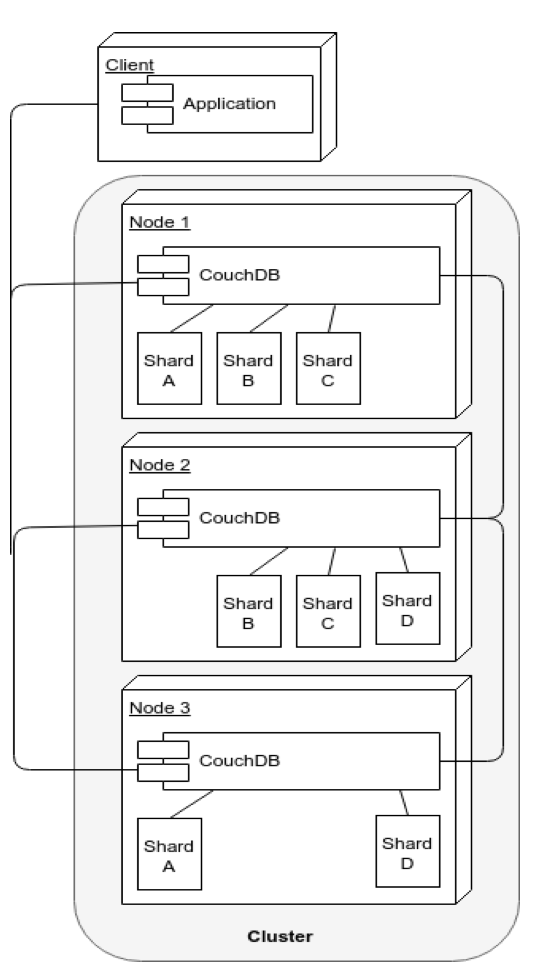
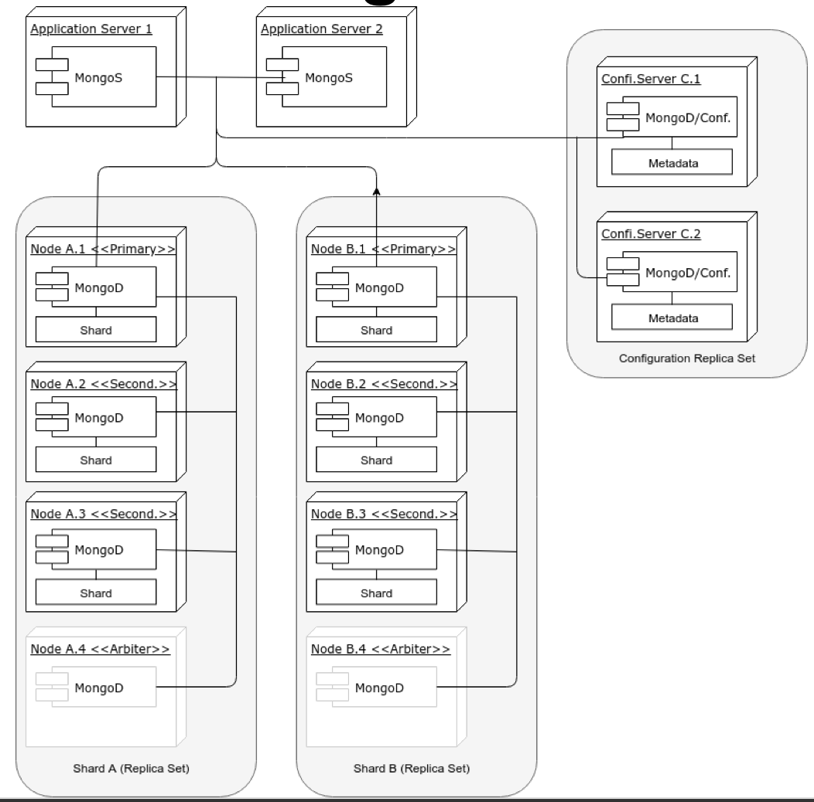
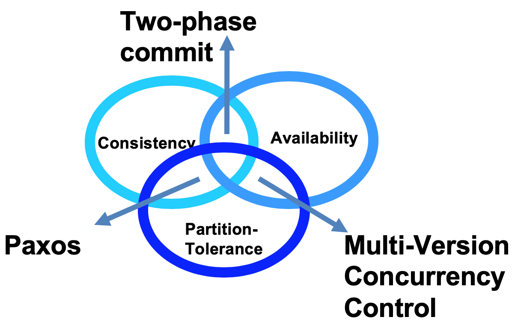
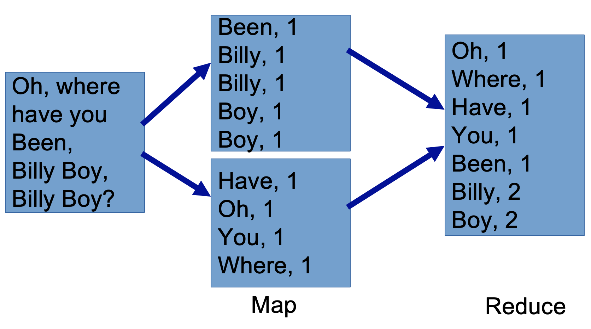

# Lecture 7: Big Data and CouchDB

#### "Big data Challenges and Architectures"
* **4V**
    1. **Volume** 数据量
    2. **Velocity** 新数据来的速度
    3. **Variety** 数据多样性
    4. **Veracity** 数据真实性
* Ad hoc solution
    * Relational model
        * tables and relationships amongst tables
    * Problem
        * relational DBMSs are extremely good at ensuring consistency, but rely on **normalised data models** (not granted in a world of big data: Veracity and Variety)
    * Solution: 
        * NoSQL DBMSs
* (NoSQL) DBMSs for distributed environments
    1. **key-value DMBS**
        * Allow the retrieval of **a chunk of data** given a key
        * Fast, but crude (粗糙)
        * E.g. Redis, PostgreSQL, Hstore, Berkeley
    2. **BigTable DMBS**
        * Stores data in columns, grouped into column families, with rows potentially containing different columns of the same family
        * E.g. Apache Cassandra, Apache Accumulo
    3. **Document-oriented DMBS**
        * Stores data as structured documents, usually in XML or JSON
        * E.g. Apache CouchDB, MongoDB
* Distributed databases are run over "clusters" (set of connected computers)
    * Clusters are needed to:
        * Distribute the computing load over multiple computers (e.g. improve **availability**)
        * Storing multiple copies of data (e.g. achieve **redundancy**)
    * Consider two document-oriented DBMs and their typical cluster architecture
        * CouchDB and MongoDB

#### CouchDB Cluster Architecture
* Answer requests
    * **All nodes answer requests** (read/write) at the same time
* Sharding
    * **Sharding** (splitting of data across nodes) is done on every node
* When a node does not contain a document"
    * the node **request it from another node** and returns it to the client
* Nodes can be added/removed easily
    * Their shards are **_re-balanced_** automatically upon addition/deletion of nodes

#### MongoDB Cluster Architecture
* Sharing
    * **Sharding** is done at the _replica set_ level
    * Hence involve more than one cluster
    * (a shard is on the top of a replica set)
* Read/write requests
    * only **primary node** in a replica set answer **write** request
    * but **read** requests can (depending on the specific configuration) be answered by **every node** (including secondary nodes) in the set
* Updates
    * updates flow only from the primary to the secondary (node)
* Primary node fails
    * if a primary node fails, or discovers it is connected to a minority of nodes
    * a secondary of the same replica set is **elected as the primary**
* Arbiters (用来break tie的)
    * Arbiters: MongoDB instances without data
    * can assist in **breaking a tie** in the **election**
* Data are balanced across replica sets
* It is better to have an **odd** number of voting members

#### MongoDB v.s. CouchDB Clusters
* MongoDB clusters are considerably **more complex**
* MongoDB clusters are **less available**
    * By default, only primary nodes can talk to clients for read operations (and exclusively so for write operations)
* MongoDB software **routers** (MongoS) must be embeded in the application
    * while **any HTTP client** can connect to CouchDB
* Losing 2 nodes out of 3
    * In CouchDB example, means losing access to 1/4 of data
    * In MongoDB example, means losing access to 1/2 of data
* Some features not supported in MongoDB shard environment
    * E.g. unique indexes

#### Consistency, Availablility, Partition-Tolerance (CAP)
1. Consistency (C)
    * every client receiving an answer **receives the same answer** from all nodes in the cluster
2. Availability (A)
    * every client **receives an answer** from any node in the cluster
3. Partition-Tolerance (P)
    * the cluster **keep on operating** when on or more nodes **cannot communicate** with the rest of the cluster
* Pick any 2, the intersection of 3 sets is **empty** !
* Brewer's CAP theorem
    * All three qualities are symmetrical
        * Consistency and Availability are at odds (争执/不一致) when a Partition happens
    * Network partitions
        * "Hard" ones may be rare
        * "Soft" ones not rare
            * slow node
        * Utimately (最后), every partition is detected by a timeout
        * Can have consequences (of partitions) that impact the cluster as a whole
            * E.g. a distributed join is only complete when all sub-queries return
        * Traditional DBMS architecture were not concerned with network partitions
            * since all data were supposed (在traditional的DBMS) to be in a small, co-located cluster of servers
        * The emphasis on numerous commodity (有益的) servers, can result in an increased number of **hardware failures**
    * CAP theorem forces us to consider **trade-offs** among different options

#### Classification of distributed processing algorithms
1. Two-phase commit
    * Consistency & Availbility
    * usual algorithm used in relational DBMS's (and MongoDB, to some extent)
    * Enforce **Consistency** by:
        * 锁定要用的数据，预写log，所有node都perform了才commit，如果有partition就rollback
        * locking data that are within the trasaction scope
        * Performing transactions on write-ahead (预写) logs
        * Completing transactions (commit) **only** when all nodes in the cluster have performed the transaction
        * **Abort** transactions (rollback) when a partition is detected
    * The procedure entails (意味着):
        * reduced availbility (data lock, **stop in case of partition**)
        * enforced consistency
    * A good solution when the cluster is co-located, less good when it is distributed
2. Paxos
    * Consistency & Partition-Tolerance
    * Driven by consensus (共识)
    * 投票机制，proposer发起一个value，accepter接受或者拒绝，达到一定数量的acceptance话，就发个确认信息告诉accepters最终同意的value
    * Every node is either a **proposer** or an **accepter**
        * **propose**
            * propose a value (with a timestamp)
        * **accepter**
            * accept or refute
            * E.g. if the accepter recives a more recent value
    * When a proposer has received a **sufficient number of acceptances** (a quorum)
        * a confirmation message is sent to the _accepters_ with the **agreed value**
3. Muti-Version Concurrency Control (MVCC)
    * Availability & Partition-Tolerance
    * 可以同时update，每个都有revision number，partition的时候request都会被accept，结束partition的时候会有conflict (相同的revision number)，需要resolve
    * **Concurrent updates** are possible without distributed locks
        * since the updates will have different **revision numbers**
        * transactions that completes last will get a higher revision number, hence will be considered as the **current value**
    * In case of **cluster partition** and **concurrent requests** with the **same revision number** going to two parititioned nodes
        * Both are accepted
        * But once the partition in solved, there would be a **conflict**
        * Conflicts would have to be solve somehow
            * E.g. CouchDB returns a list of all current conflicts, which are then left to be solved by the application

#### Why Document-oriented DBMS for Big data?
* 虽然relational DBMBs能很好的保证Consistency和Availability，但是他的normalisation产生的fine-grained data比起coarse-grained data，更不助于partition-tolerance
* While relational DBMSs are extremely good for ensuring consistency and availability, the **normalization** that lies at the heart of a relational database model implies **fine-grained data**, which are less conducive to partition-tolerance than coarse-grained data
* Example:
    * a typical contact database in a **relational** data model may include:
        * a person table
        * a telephone table
        * an email table
        * an address table
    * all related to each other
    * same database in a **document-oriented** database would entail **one document type** only, with telephone numbers, email address, etc. (nested as arrays in the _same document_)

#### MongoDB v.s. CouchDB clusters
* CouchDB -> MVCC
* MongoDB -> mix of:
    * Two-phase commit
        * replicating data from primary to secondary nodes
    * Paxos-like
        * to elect primary node in a replica-set

#### Sharding
* Partitioning of a database "horizontally"
    * the database rows (or documents) are partitioned into subsets that are stored on different servers
    * each **subset of rows (or documents)** is called a **shard**
* Usually
    * _number of rows_ > _number of replicas_
    * _number of nodes_ > _number of replicas_
    * number of replicas usually set to 3
* Main advantage:
    * improvement of **performance** through the **distribution of computing load** across nodes
    * make it easier to move data files around
        * e.g. when adding new nodes to the cluster
* The number of shard dictates the (meaningful) number of nodes
    * the maximum number of nodes = the number of shards
    * lest (生怕) a node contains the same shard file twice
* Different sharding strategies:
    1. Hard sharding
        * distribute rows **evenly** across the cluster
    2. Range sharding: 
        * similar rows are stored on the same node

#### Replication & Sharding
* Replication
    * action of **storing the same row (or document)** on different nodes to make the database fault-tolerant
    * replication & sharding can be combined with the objective of: 
        1. **maximizing availability** 
        2. maintaining a minimum level of data safety
    * nomenclature (命名)
        * `n` is the number of replicas
        * `q` is the number of shards
        * `n*q` is the total number of shard files distributed in he different nodes of the cluster

#### MapReduce algorithm
* Particularly suited to parallel computing of **Single-Instruction Multiple Data(SIMD)** type
* Steps:
    1. **Distribute**
        * distribute data across machines
    2. **Reduce**
        * hierarchically summarizes them until the result is obtained
* Advantage lies in:
    * **moving process** to where data are, greatly **reducing network traffic**

#### Intro to Couchdb
* Why CouchDB?
    * open-source
    * has MapReduce queries
    * easy to setup a cluster
    * has sharding and replication
    * HTTP API makes it easy to _interact_ with
* Main feature:
    * **Document-oriented** DBMS
        * Documents expressed in JavaScript Object Notation (JSON)
    * HTTP **ReST** API
    * **Web-based admin** interface
    * Web-ready
        * it talks HTTP and produces JSON
        * can be both the data and logic tier and a three-tier application
        * avoiding marshalling and unmarshalling of data objects
    * Support for **MapReduce** algorithm
        * including aggregation at different levels
    * **JavaScript** as the default data manipualtion language
    * Run **Mango queries**
        * can use indexes for better performance
    * Schema-less data model with **JSON** as the data definition language
    * Support for replication, sharding, clusters
* Using Fauxton User Interface
* HTTP call examples:
    * Adding and deleting a database
        * `curl -X PUT "http://localhost:5984/exampledb"`
        * `curl -X DELETE "http://localhost:5984/exampledb"`
    * List all DBs of an instance
        * `curl -X GET "http://localhost:5984/_all_dbs"`
        * response: JSON Object `["exampledb", "twitter", "instagram"]`
* System properties of documents
    * `_id` is the **ID** of a single document
        * by default, it is generated by CouchDB and guarantee to be unique
    * `_rev` is the **revision number** of a document
        * guaranteed to be increasing per-document
        * i.e. every database instance will pick up the same revision as the current version of the document
* The way to avoid conflicts in MVCC is to state which revision the update refer to
* Solving a conflict after partition of cluster
    * 2 different updates with 2 different revision numbers
        * the **wining revision** is computed deterministically, hence guaranteed to be the **same** on any node of the cluster
        * The wining one returned as the **current revision**
    * To help inn the merging of conflicts, CouchDB can return all the conflicts in a database
* Documents are not deleted until they are "purged" (POST .../_purge)
    * Hence can be retrieved with a bit of effort
    * e.g. add documents with the same id, then retrieve the old revision

#### Querying a CouchDB Database
* CouchDB has 2 mechanisms to **select a set of documents** that exhibit certain features:
    1. MapReduce Views
        * results of MapReduce processes that are written as B-tree indexes to disk, and become part of the database
    2. Mango Queries
        * queries expressed in JSON, following the MangoDB queries syntax (also use B-tree -> speed up computations)
* CouchDB Views
    * definition of MapReduce jobs that are updated as new data come in and are **persisted**
    * Are not:
        * Relational SQL queries
        * Relational Views
        * Indexes
    * Similar to Index-organized tables in Oracle
    * Views are **fast and store aggregated data** (which is great for analytics), but are **inflexible and use a lot of storage**
    