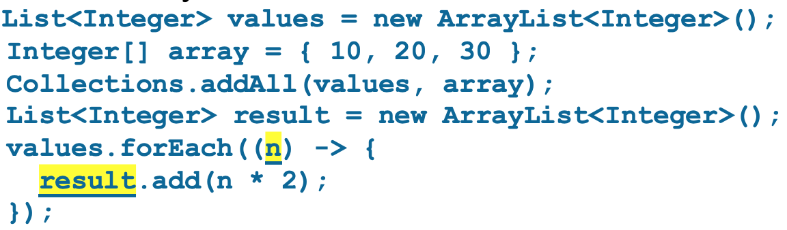
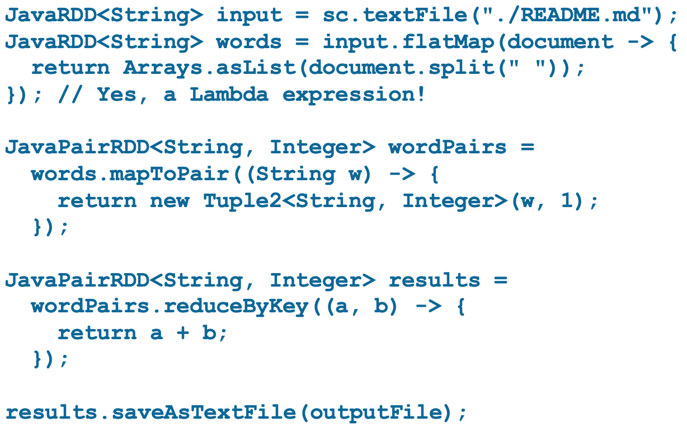
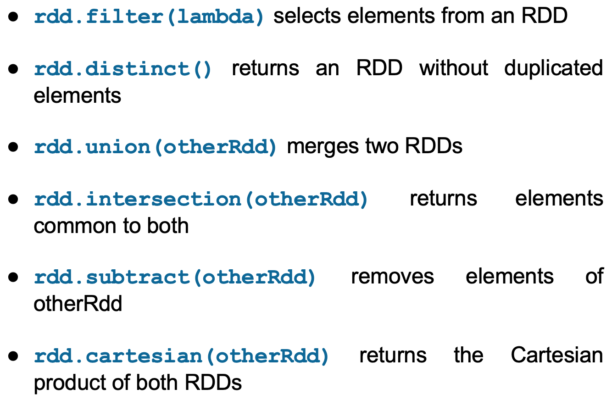
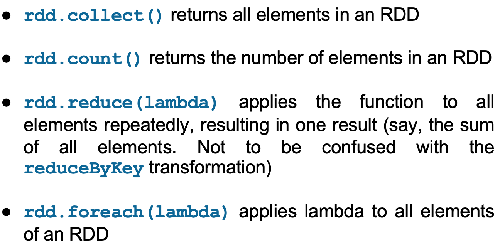
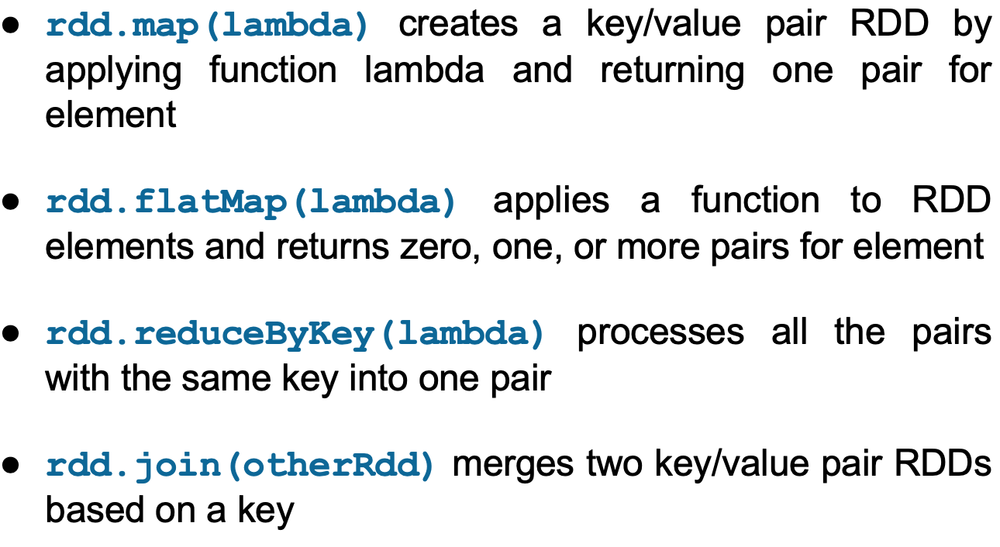

# Lecture 8: Big Data Analytics

#### Intro to Big Data Analytics
* Challenges of Big Data Analytics:
    1. Reading & writing distributed datasets
    2. Preserving data in the presence of failing data nodes
    3. Supporting the execution of MapReduce tasks
    4. Being fault-tolerant
    5. Coordinating the execution of tasks across a cluster
* Tools for analytics:
    * Examples:
        * Statistical packages (R, Stata, SAS, ...)
        * Business Intelligence tools (Tableau, Business Objects, ...)
        * Information retrieval tool (ElasticSearch, IBM, ...)
    * In big data, most applications built on top of an **open-source framework**: **Apache Hadoop**

#### Apache Hadoop
* Started as a way to **distribute files over a cluster** and **execute MapReduce** tasks, but many tools have now been built on that foundation to add further functionality
* Hadoop Distributed File System (HDFS)
    * Core of Hadoop: **fault tolerant** file system that has been explicitly designed to span many nodes
    * HDFS blocks are **much larger blocks** used by an orginary file system (e.g. 4KB v.s. 128MB), reasons for this unusual size:
        * 减少储存block位置所需的内存，减少network使用，减少seek，如果每个block的大部分数据都被用到的话更efficient
        1. Reduced need for memory to store **information about where** the blocks are (meta)
        2. More efficient use of the network (a **reduced number of network connects** needs to kept open)
        3. Reduced need for **seek operations** on big files
        4. **Efficient** when most data of a block have to be processed
* HDFS file
    * a collection of blocks stored in **datanodes**, with metadata (such as position of those blocks) that is stored in **namenodes**


#### Hadoop Resource Manager (YARN)
* 管理MapReduce的
* Another main component of Hadoop: **MapReduce task manager**, **YARN** (Yet Another Resource Negotiator)
* **YARN**: 
    * deals with executing MapReduce job on a cluster
    * composed of: 
        * a **central Resource Manager** on the master
        * many **Node Managers** that reside on slave machines
    * Steps:
        1. a MapReduce job scheduled for execution on a Hadoop cluster
        2. YARN starts an **Application Master** that negotiate resources with the **Resource Manager** and starts **Containers on the slave nodes**
            * Containers: processes where the actual processing is done, not Docker containers

#### HDFS Shell
* **Managing the files on a HDFS cluster** cannot be done on the operating system shell, hence a **custom HDFS shell** must be used
* HDFS file system shell replicates many of the usual command (ls, rm, etc.), with some **other commands** dedicated to loading files from the operating system to the cluster (and back):
    * `$HADOOP_HOME/bin/hadoop fs -copyFromLocal <localsrc> <dst>`
* Status of HDFS cluster and its content can be seen on a web application

#### Programming on Hadoop
* Main language for MapReduce on Hadoop: **Java**
    * other languages can be used via different APIs
    * indeed, any language that can read from standard input and write to standard output can be used
* `hadoop` command is used to: 
    * load the program and sent it to the cluster
        * with the `-file` option
    * the mapper and reducer can be specified by:
        * `-mapper` and `-reducer`
        * `aggregate` use the Hadooop internal _aggregator_ library
    * Example:
    
    ```BASH
    $HADOOP_HOME/bin/hadoop jar \
    $HADOOP_HOME/hadoop-streaming.jar \
    -D mapreduce.job.reduces=12 \
    -input myInputDir \
    -output myOutputDir \
    -mapper myAggregatorForKeyCount.py \
    -reducer aggregate \
    -file myAggregatorForKeyCount.py
    ```

---

#### Apache Spark
* Why Spark?
    * Hadoop is geared toward performing **relatively simple jobs on large datasets**
    * complex jobs (e.g. machine learning or graph-based algorithms) -> there is strong incentive (动机) for: 
        1. **caching** data in memory
        2. having **finer-grained control** on the execution of jobs
    * **Advantage:** 
        * designed to **reduce the latency** inherent (天生) in the Hadoop Approach for the execution of MapReduce jobs
    * Spark can **operate within the Hadoop architecture**: 
        1. Using **YARN and Zookeeper** to manage:      computing resources
        2. Storing data on **HDFS**
* Spark Architecture
    * One of the strong points of Spark is the **tighjtly-coupled** nature of its main components
    
    * Spark ships with a cluster manager of its own, but it can work with other cluster managers, such as **YARN or MESOS**

#### Programming on Spark
* mostly written in **Scala**, and uses this language by default in its interactive shell
    * however, APIs of Spark can be accessed by different languages: R, Python, and Java
* Scala
    * multi-paradigm language: both functional and object-oriented
    * runs on JVM and can use Java libraries and Java objects
* Most popular language used to develop Spark: Python and Java
    * other than Scala, there is a shell for Python (pySpark)

#### Getting data in/out of Spark
* Spark can read/write data in many formats, from text file to database, and it can use different file systems and DBMSs
* Simplest way to get data into Spark (csv):
    * reading data from a csv file from the local file system
    * with a small change, Spark can be made to read from HDFS file system
    * `csv = sc.textFile("hdfs://file.csv")`
* Another popular format: JSON
* An efficient data format that is **unqiue** to Hadoop is: **sequence file**
    * a flat file composed of key/value pairs
* Another option to load/save data:
    * serialised Java objects (Kryo library)
    * simple to implement, but neither faster nor robust
* **HDFS or distributed DBMSs** can be used in conjunction with Spark
* SQL queries can also be used to extract data
    * `df = sqlContext.sql("SELECT * FROM table")`
* Relational DBMSs can be a source of data too
    * e.g. via JDBC
* CouchDB, MangoDB, and ElasticSearch connectors are available

#### Spark Shell and Non-interactive jobs
* Spark shell
    * Allow to send command to the cluster interactively in either **Scala or Python** (while Hadoop uses Java)
    * While the shell can be extremely useful
        * it **prevents Spark** from **deploying all of its optimizations** -> leading to **poor performance**
        * therefore -> use **non-interactive** jobs in Spark
    * Example in Python:
    
* Non-interactive jobs
    * 才会optimise
    * Example in Java 7:
    

#### Spark Runtime Architecture
* Apps in Spark are composed of:
    1. Job
        * 整个job
        * data processing that has to be performed on a dataset
    2. Task
        * a single operation on a dataset
    3. Executer
        * 跑task的
        * the processes in which tasks are executed
    4. Cluster Manager
        * 分task的
        * the process assigning tasks to executors
    5. Driver program
        * **main logic** of the application
    6. Spark application
        * Driver program + Executors
    7. Spark Context
        * within driver program
        * general **configuration** of the job
        * **deployment mode** (3 modes) is set in the Spark Context
        * set the configuration of a Spark application, including the cluster it connects to in cluster mode
        * can also be used to tune the execution by:
            1. setting the **memory**
            2. setting the **number of executors** to use
* 3 modes:
    1. Local Mode
        * 所有都在同个JVM跑，有多个executor的话还是可以parallel，适合开发和debug
        * every Spark Component runs within the **same JVM**
        * Spark App can still run in **parallel**
            * as there may be **more than one executor active**
        * good when developing/debugging

        
    2. Cluster Mode
        * 1个 Master node 放 Cluster Manager，Driver Program，剩下的 Slave nodes 放 Executors
            * 适合non-interactive job
        * every component, including the driver program, is executed on a cluster
        * upon launching, the job can run autonomously
        * common way of running non-interactive Spark jobs

        
    3. Client Mode
        * Master node里放Cluster Manager，Driver Program放在另一个node上，Slave nodes放Executors
            * 必须要interactive job
        * the driver program **talks directly to the executors** on the worker nodes
        * the machine hosting the driver program has to be connected to the cluster until job completion
        * must be used when the apps are interactive (as happens in R, Python, or Scala Spark Application)

        

---

#### Resilient Distributed Dataset (RDD)
* the way data are stored in Spark **during computation**
    * **Resilient** (弹性)
        * data are stored **redundantly**, hence a failing node would not affect their integrity
    * **Distributed**
        * data are split into chunks, and these chunks are sent to **different nodes**
    * **Dataset**
        * a dataset is just a collection of objects, hence very generic
* **crucial** to writing programs in Spark
* Properties
    1. **Immutable**
        * once defined, they cannot be changed
        * (greatly simplifies parallel computing on them, is consistent with functional programming paradigm)
    2. **Transient** (短暂)
        * meant to be used only once, then discarded
        * (they can be cached, if improve performance)
    3. **Lazily-evaluated**
        * 可以说Evaluate = Action
        * 有Action的时候RDD才真的做运算，之前的Transformation都只是事先声明了要这么transform
        * the evaluation process happens only when data cannot be kept in an RDD, as when (比如): (these are called **actions**)
            1. the _number of objects_ in an RDD has to be computed
            2. an RDD has to be _written to a file_
        * but not when an RDD are transformed into another RDD (called **_transformations_**)
* Build RDD
    * usually created out of data stored elsewhere (HDFS, a local text file, a DBMS)
    * can be created out of collections (e.g. lists) too, using paralleliza function (`sc.parallize(data)`)
* Aside: Lambda Expression
    * 没名字的function
    * often known as **closure**, in Javascript, as **callbacks**, or in Scala or Python as **lambda functions**
    * Example:
    
    * (params) `->` { body of expression }
        * data types of params are usually inferred
    * can **access variables** defined in the same scope of the expression
* A few points about the example of driver program using RDDs:
    * **RDD transformations** use Lambda Expression (closures) to simplify programming and avoid side-effects
    * the only **action** in this `saveAsTextFile` (RDD written to a file), all the others are transformations (into another RDD)
    * RDD variables are **just placeholders until the action is encountered**
        * Spark application is **not just the driver program**, but all the RDD processing that takes place on the cluster
            * Spark Application = Driver program + Executors

    

---

#### Order of Execution of MapReduce Tasks
* Execution order of Hadoop MapReduce is **fixed**
    * Lazy evaluation of Spark -> allows developers to stop worrying about it, and have **Spark optimizer** to take care of it
* Driver program can be **divided into steps** that are easier to understand without sacrificing performance
    * as long as those steps are composed of **transformations**
* Examples of **transformations** of RDD
    * 产生新的RDD
    
* Examples of **actions** of RDD
    * 注意: `rdd.foreach(lambda)`也是action
    
* Examples of Key/Value Pair Transformations
    

#### **Caching** Intermediate Results
* Spark好处之一
* `rdd.persist(storageLevel)` can be used to **save** an RDD either in memory and/or disk
    * The `storageLevel` can be tuned into different **mix of use of RAM or disk** to store the RDD
    * Note: since RDD immutable, the r**esult of final transformation is cached**, not the input RDD

#### Tunning the degree of parallelism (Spark)
* Spark partitions data across the cluster according to some **heuristic**
    * however, sometimes useful to force it to partition data in a **given number of pieces**
* Some transformations allow for a **second param** containing the **desired number of partitions**
    * e.g. `sc.textFile("bigFile.csv", 10)`
* An RDD can also be re-partitioned explicitly
    * `rdd.repartion(partitionNum)`
* Another way to partition an RDD: **partitioner**
    * a strategy to guide the partitioning 
    * e.g. `rdd.partitionBy(new HashPartitioner(100))`

#### Spark Jobs, Tasks, Stages
1. **Job**
    * **overall processing** that Spark is directed to perform by a driver program
    * Composed of **more than one stage** when data are to be transferred across nodes (shuffling)
2. **Task**
    * single transformation operating on a single partition of data on a single node
3. **Stage**
    * 数据有transfer的话要用不同stage？
    * a set of task on a single partition
* The fewer the number of stages, the faster the computation (shuffling data across the cluster is slow)
