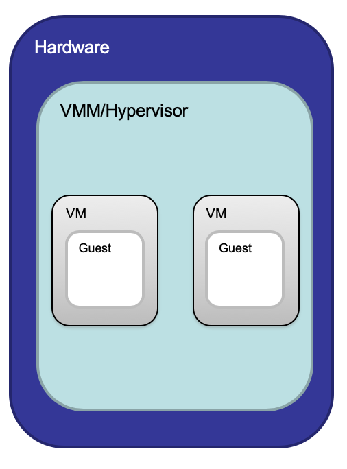

# Lecture 9.1: Virtualisation (VM)

#### Terminology
* Virtual Machine (VM) Monitor/Hypervisor
    * the **virtualisation layer** between:
        1. underlying hardware
        2. VMs and the guest OS it supports
    
* Virtual Machine (VM)
    * a representation of a real machine using hardware/software that can **host** a guest OS
* Guest Operating System (Guest OS)
    * an OS that runs in a **virtual machine environment** that would otherwise run directly on a separate physical system