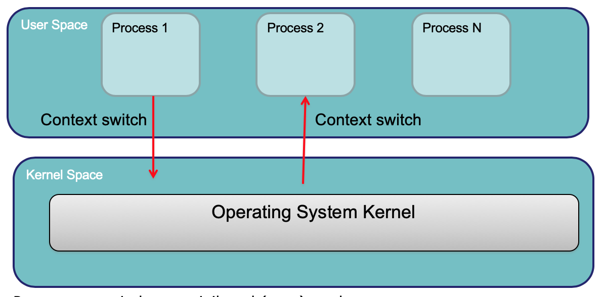
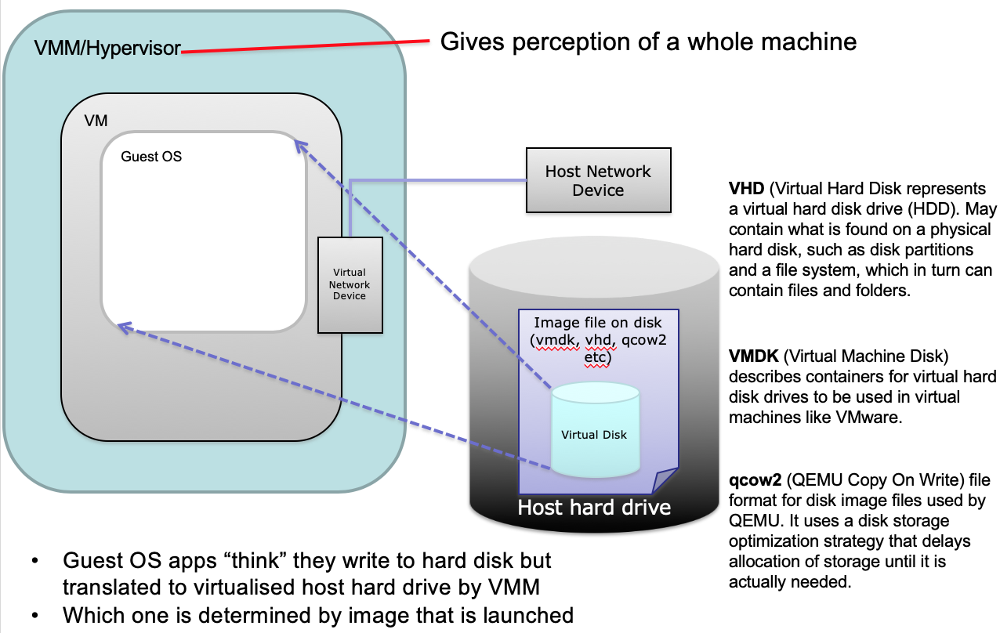

# Lecture 9.1: Virtualisation (VM)

#### Terminology
* Virtual Machine (VM) Monitor/Hypervisor
    * the **virtualisation layer** between:
        1. underlying hardware
        2. VMs and the guest OS it supports
    * The environment of VM should appear to be the same as the physical machine
    *  Minor decrease in performance only
    * Appear as though in control of system resources

    
* Virtual Machine (VM)
    * a **representation of a real machine** using hardware/software that can **host a guest OS**
* Guest Operating System (Guest OS)
    * an OS that runs in a **virtual machine environment** that would otherwise run directly on a separate physical system

#### Kernel-User mode separation
* process在user mode跑，kernel在kernel space跑，OS通常会虚拟化memory，CPU，和disk等，给process一种能使用一部分/整个资源的错觉，实际上processes之间要share资源
* Processes run in lower priviledged mode (user mode)
* OS typically _**virtualises**_ memory/CPU/disk, ...
    * **giving appearance of complete access** to CPU/memory/disk to application process
    * each process has **illusion** of access to some/all of the memory or the CPU
        * but actually shared across multiple processes
* **Context switches** can catch (trap) "sensitive" calls
    * sensitive calls: instruction sets are typically **device specific**
    * (Context switch: 换个thread来运行)

#### What happens in a VM
* Hypervisor
    * Gives perception of a whole machine
* Virtual Hard Disk (VHD)
    * repersents a virtual hard disk drive
    * may contain what is found on a physical hard disk

#### Motivation of VM
1. Server Consolidation (合并)
    * increased utilisation
    * reduced energy consumption
2. Personal VM can be created on demand
    * No hardware purchase needed
    * public cloud computing
3. Security / Isolation
    * Share a single machine with multiple users
4. Hardware Independence
    * Relocate to different hardware